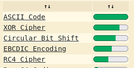
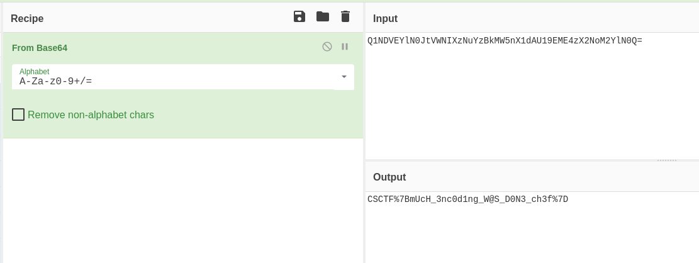

# Chef

- Category: Cryptography
- Difficulty: Easy
- Points: 100
- Author: N/A

## The Challenge
You must be a cyber chef to see the ingredients I put in mixing up these encodings. Can you figure it out? 

0x510x310x4e0x440x560x450x590x6c0x4e0x300x4a0x740x560x570x4e0x490x580x7a0x4e0x750x590x7a0x420x6b0x4d0x570x350x6e0x580x310x640x410x550x310x390x450x4d0x450x340x7a0x580x320x4e0x6f0x4d0x320x590x6c0x4e0x300x510x3d

## Walkthrough
With these crypto challenges that contain hashes the step I always take first is running it through [DCode's Cipher Identifier](https://www.dcode.fr/cipher-identifier). We find out its ASCII.



Just click where it says "ASCII Code" and there you'll be able to decode the hash. It gives us another hash: 

```Q1NDVEYlN0JtVWNIXzNuYzBkMW5nX1dAU19EME4zX2NoM2YlN0Q=```

You can go back to the Cipher Identifier and find out what it is but here's a tip, if it ends in "=" or "==" it's almost always Base64.
By reading the challenge it's clear they want us to use [Cyber Chef](https://cyberchef.io/) so let's use their "From Base64" option.



We have our flag! Not quite, it is ```CSCTF%7BmUcH_3nc0d1ng_W@S_D0N3_ch3f%7D``` but since we know the standard format let's just assume ```%7B``` and ```%7D``` are ```{``` and ```}``` respectively.

## Flag

```
CSCTF{mUcH_3nc0d1ng_W@S_D0N3_ch3f}
```