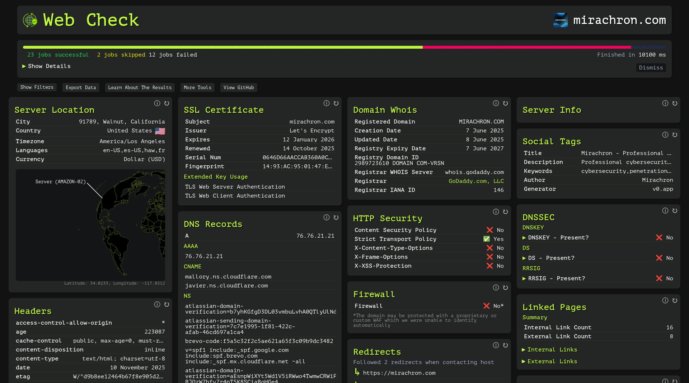

# Domain

- Category: OSINT
- Difficulty: Medium
- Points: 50
- Author: N/A

## The Challenge
Go to https://web-check.xyz/ and scan mirachron.com. Answer the checks below in order with yes or no in lowercase. Checks (in this exact order):

1. Is a Strict-Transport-Security header present on https://mirachron.com?
2. Does the HSTS policy include all subdomains?
3. Is a Content-Security-Policy header present?
4. Is X-Content-Type-Options present?
5. Is an Access-Control-Allow-Origin header present?
6. Is DNSSEC enabled for mirachron.com?
7. Does mirachron.com publish a DMARC record?
8. Does mirachron.com have MX records configured?
9. Is /.well-known/security.txt present?
10. Is a web application firewall detected? 
- Example : CSCTF{no_yes_no_yes_no_yes_no_yes_no_yes}

**Commands Used:**  
- Just go to the URL 

## Walkthrough
We start by going to ```https://web-check.xyz/``` and enter ```mirachron.com``` on the input box. After it finalizes analyzing the website we get something like this:



Now we just look at the information (very direct) and make the flag with the answers in the order of the questions.

## Flag

```
 CSCTF{yes_no_no_no_yes_no_no_yes_no_no} 
```