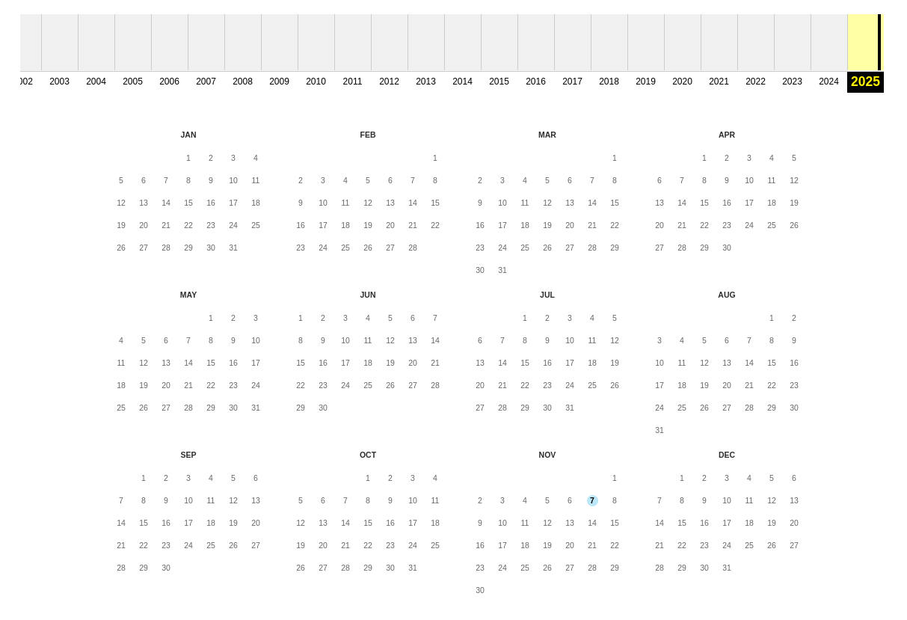

# History

- Category: OSINT
- Difficulty: Easy
- Points: 50
- Author: N/A

## The Challenge
You're confirming when 2025.chronos-security.ro was first captured by the Internet Archive. Find the earliest snapshot and convert its timestamp to ISO date (YYYY-MM-DD). Submit that date in the flag.

## Walkthrough
We start by going to ```archive.org```, enter ```2025.chronos-security.ro``` on the input box and search.



We see only one record of the website is shown, on the 7th of November 2025 so that's our flag.

## Flag

```
 CSCTF{2025-11-07} 
 ```