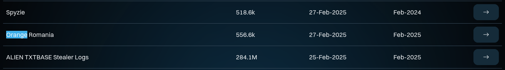
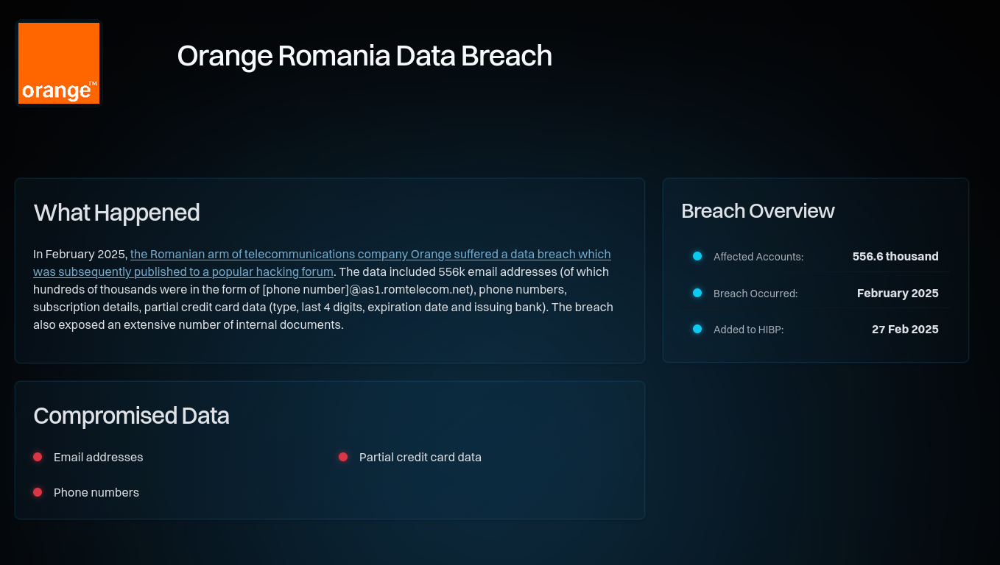
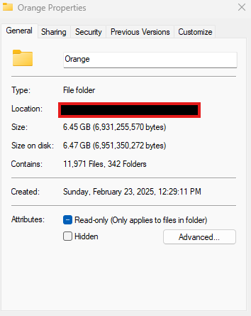

# Pwned

- Category: OSINT
- Difficulty: Easy
- Points: 50
- Author: N/A

## The Challenge
Investigate a major breach entry on Have I Been Pwned for the romanian subsidiary of the telecom company Orange. We want you to report how many files and folders were stolen in those near 6.5GB worth of data. 

Example: CSCTF{12345-700}

## Walkthrough
The first step is finding what the subsidiary is, so by doing a simple search for "Orange Romania subsidiary" we find ```orange.ro```, that's the target we'll analyze in HIBP.

Then go to ```https://haveibeenpwned.com/```. Usually HIBP is used to check our email for data breaches and password leaks but it also has a database of breaches for us to explore on the top of the website, where it says "Who's Been Pwned".

Doing a simple ```Ctrl + F``` and searching for Orange shows us what we need, proceed by opening the breach details.





Unfortunately it doesn't give us enough details since the challenge asks for the exact number of files and folders, so we'll have to dig deeper. Notice the blue hyperlink? Look into it, if you read the complete article there's a nice picture that has exacly what we want:



```Created 11.971 Files, 342 Folders```

## Flag

```
 CSCTF{11971-342} 
```