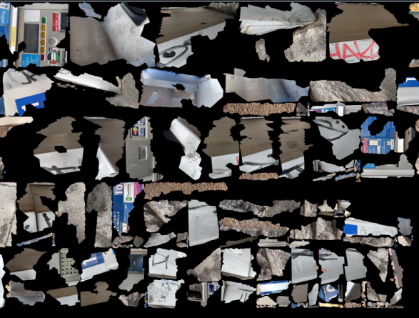
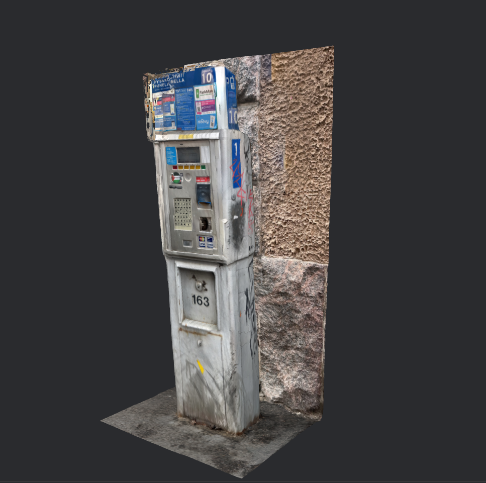
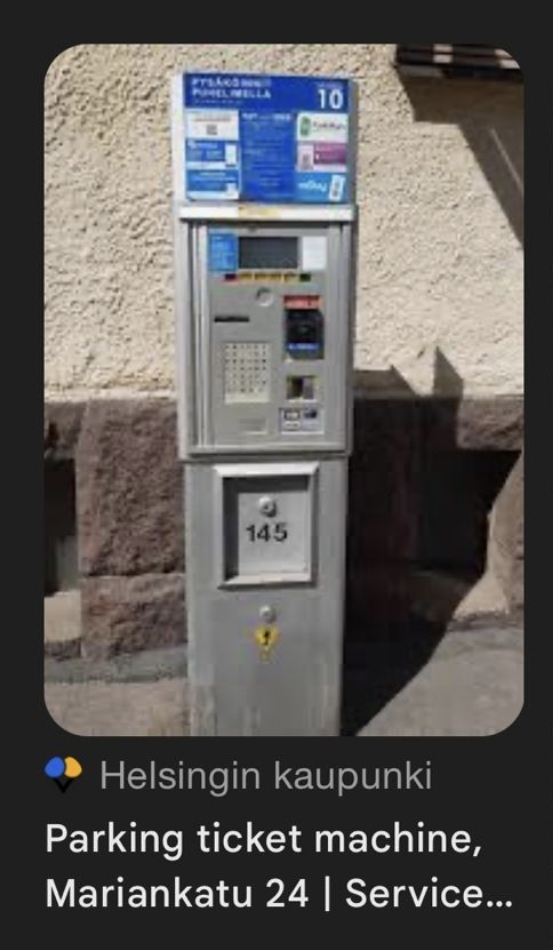
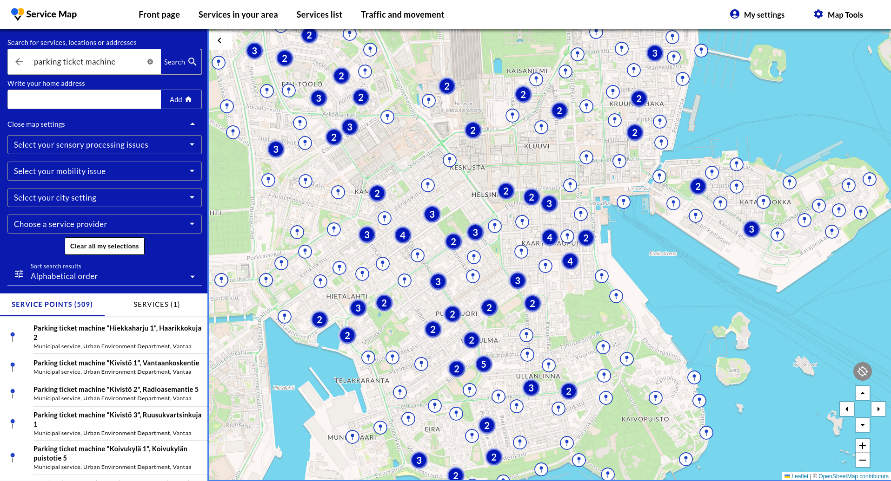
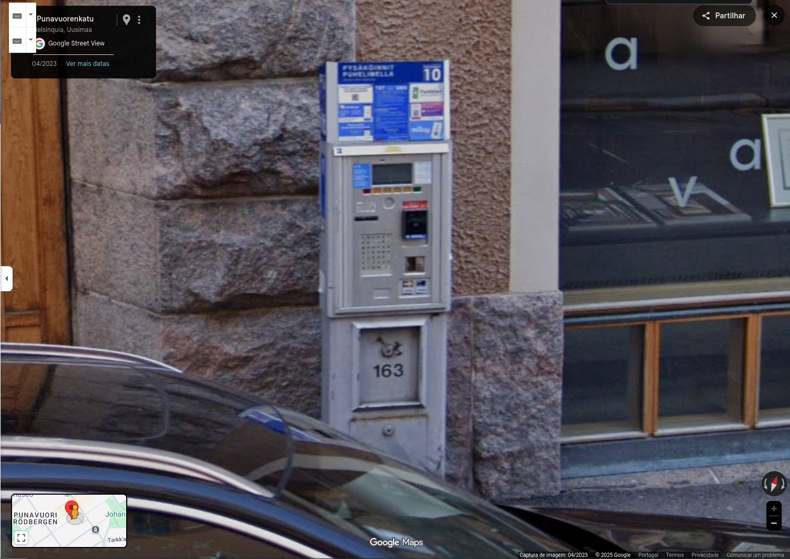
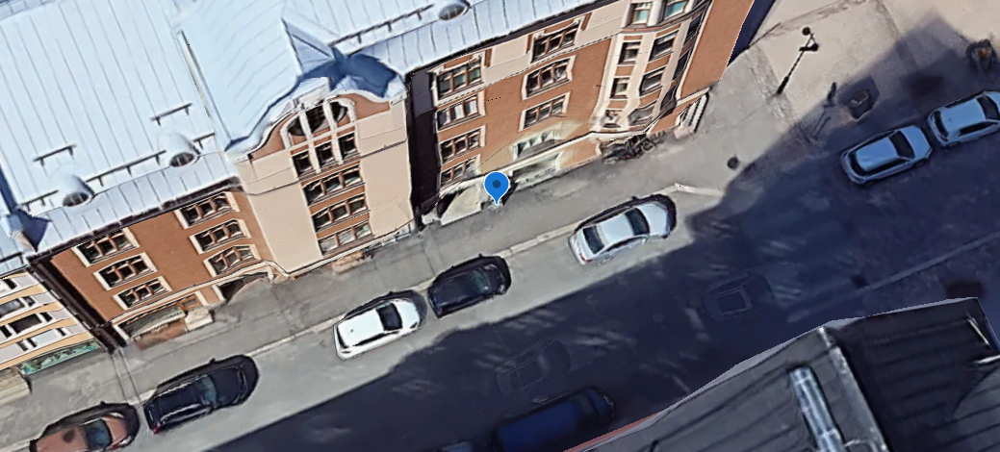

# Sakot

- Category: OSINT
- Difficulty: Medium
- Points: 100
- Author: Sam (p3wp3w)

## The Challenge
Can you locate where this scan was taken?
Rounded to 4 decimal places, no spaces.
Download files here: sakot.zip 

Flag example: CSCTF{69. 4209,67. 3932}


## Walkthrough
This was a harder challenge with many different approaches so instead of writting a direct guide I'll write my personal experience.

Starting by looking at the files provided, I noticed they all have the same name "textured-output" and each has a different extension: ```.obj```, ```.mlt```, ```.jpg```.

My instinct lead me to the .jpg first since it was an image, at first glance it looked like a puzzle I had to complete in photoshop:



As I was getting ready to tackle this challenge I thought about the other two files and searched what those extensions were. After learning they were part of a 3D Scan it all made sense! This was a 3D scan, not a puzzle, so I opened the files in [3D Viewer](https://3dviewer.net/) and the truth was revealed.




It looked like a payment terminal for parking or public transportation tickets in Europe, the information board also had some brand "HSL HSR" which my googling showed it was the city of Helsinki, capital of Finland.

At first I tried to find something about those numbers "10" and "1" on the side thinking they were public transportation numbers, so I checked in which stations the tram line 10 and 1 meet, but in Google Street View I couldn't even find one of those machines, much less the 163.

I needed to find more information about them, since my Finnish skills are non-existant I resorted to Reverse Image Searching with Google Lens and I got this:



So I got the confirmation it's a parking machine in Helsinki, but what suprised me the most was the number, 145 was not far from mine. Opening the website of that picure revealed another step in the right direction, a map of all the parking ticket machines in Helsinki... now the hunt begins.



And after 30 minutes checking out parking ticket machines on Street View I finally found this:



Finally what I was looking for. The coordinates on Maps were being innacurate so I changed to Google Earth and got the right ones: ```60°09'42"N 24°56'22"E```



Since the challenge asked for decimal coordinates I just used the first converter I found and got the answer for the flag after rounding it to 4 decimal places.

## Flag

```
CSCTF{60.1617,24.9394} 
```

T2JyaWdhZG8gw6AgbWluaGEgcXVlcmlkYSBMaWxhIHBlbGEgYWp1ZGEgbmVzdGUgZSBlbSB0b2RvcyBvcyBwcm9ibGVtYXMgPDMK==