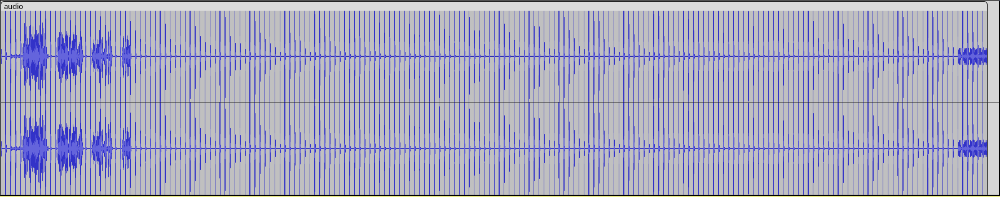
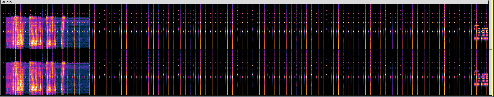
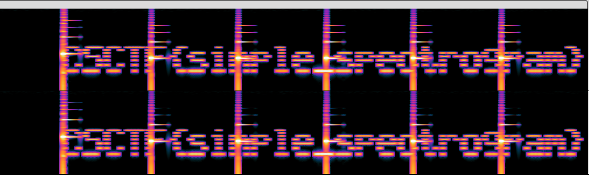

# Specter

- Category: Steganography
- Difficulty: Easy
- Points: 100
- Author: N/A

## The Challenge
Are you on the same frequency as me? I can't hear you! Answer already!

Download the file here: audio.wav

## Walkthrough
With this challenge we got an audio file, it was a lot of "nonsense" sounds.

The first thing is always opening it in Audacity and analyzing the wave, remember this is Stegano, a type of challenge where messages are hidden in "plain sight" (metadata, hidden layer, etc.) so we're already expecing to disregard the audio and look at it from a different perspective.

This is the waveform of the audio, after investigating I couldn't find any suspicious details so I moved on to the next step.



Remember the challenge name Specter? Maybe that's a hint to look at the spectogram of the audio, this is it:



After zooming on the first section of audio it looks normal, but can you see that faint glow at the end? Let's look into it.



And that looks like a flag to me!

## Flag

```
CSCTF{simple_spectrogram} 
```