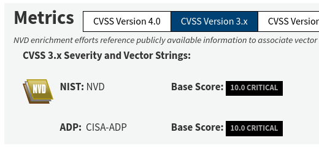

# VulnDB

- Category: OSINT
- Difficulty: Easy
- Points: 50
- Author: N/A

## The Challenge
You're investigating a critical remote code execution in a widely used Java logging library disclosed in December 2021 and nicknamed "Log4Shell". Find its official CVE entry on the National Vulnerability Database (NVD). On that NVD page, read the CVSS v3.1 Base Score. Submit both values in the flag. 

Example: CSCTF{CVE-2019-40401-5.0}

## Walkthrough
There are multiple ways to approach this challenge. If we go to the NVD and search "Log4Shell" it doesn't return a result, since it's a nickname, so it's necessary to find the true "name".

A simple Google search for "Log4Shell" shows the official Wikipedia page, which has the CVE identifier we want for the NVD: CVE-2021-44228.

Now by searching that on on the NVD we find the vulnerability page. Since we already have the CVE the only thing missing is the Base Score, which we find in the "Metrics" category.



## Flag

```
CSCTF{CVE-2021-44228-10.0} 
```