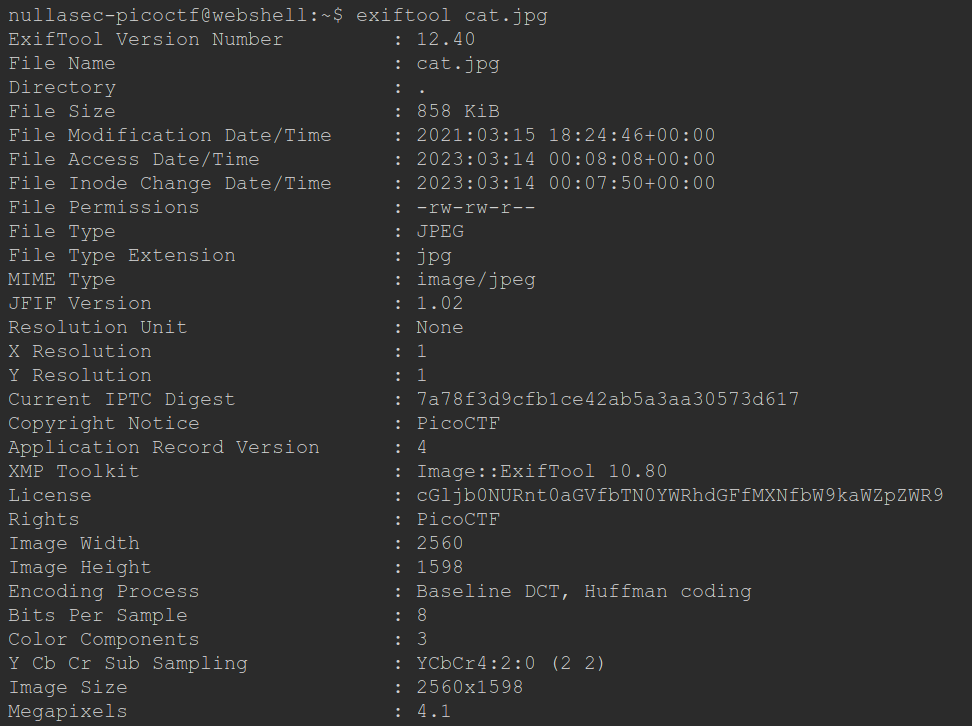
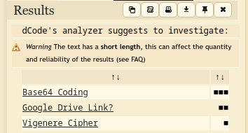
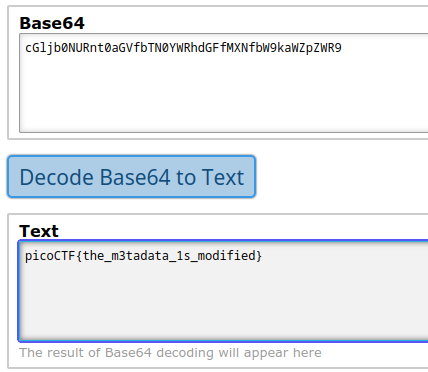

# information Writeup

Things start getting harder here, for someone using Linux for the first time they'll need to Google a little bit.

Some important things to know:
- Images can store hidden info on the metadata;
- You can analyze the metadata with a tool called ExifTool.

Start by getting the file on your terminal: `https://mercury.picoctf.net/static/e5825f58ef798fdd1af3f6013592a971/cat.jpg` 

Next let's check the metadata: `exiftool cat.jpg`

That license looks so weird... it should be readable text, not that mess.

It's something encoded in some algorythm, so let's find what algorythm it is so we can crack it.

Pasting the hash in dcode.fr gave me this results:

Looks like it's a Base64 hash, if we put it in a Base64 translator it gives us:

It looks like `picoCTF{the_m3tadata_1s_modified}` is our flag!

