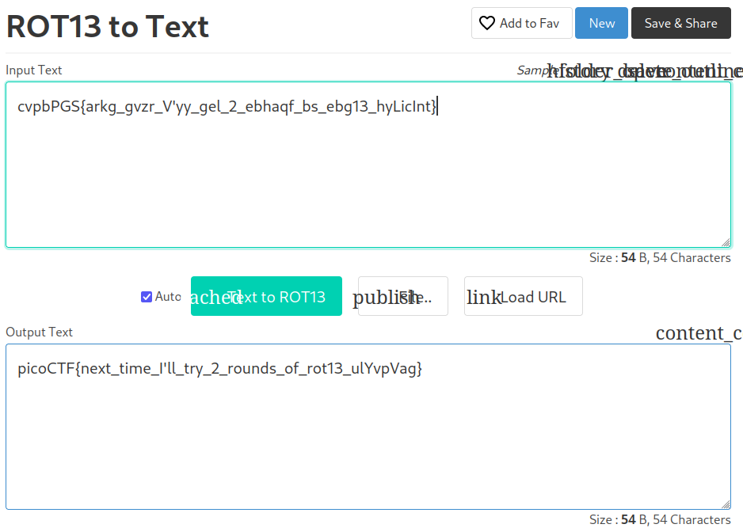

# Mod 26 Writeup

Welcome to crypto! No... not that crypto, we're talking about cryptography! The art of encoding something with complex algorithms that take years to uncover the information. Fortunately today our CTF is much easier :)

The problem's description mentions ROT13 which is an algorythm to encrypt information. 

Below we have the encrypted flag: `cvpbPGS{arkg_gvzr_V'yy_gel_2_ebhaqf_bs_ebg13_hyLicInt}`

So we can use a ROT13 to text translator online:

Again, sorry for the broken website but our flag is: `picoCTF{next_time_I'll_try_2_rounds_of_rot13_ulYvpVag}`