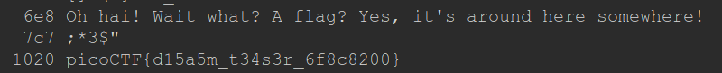

# Static ain't always noise Writeup

This one is similar to "Python Wrangling", we start by downloading the files:

- Binary: `wget https://mercury.picoctf.net/static/0f6ea599582dcce7b4f1ba94e3617baf/static`

- BASH Script: `wget https://mercury.picoctf.net/static/0f6ea599582dcce7b4f1ba94e3617baf/ltdis.sh`

If we try to execute the script we get an error, because we dont have permission to execute. 

So with `chmod -x ltdis.sh` the script is now executable.

Doing `./ltdis.sh static` now gives us this message among others:

`Any strings found in static have been written to static.ltdis.strings.txt`

Finally if we open that file with `cat static.ltdis.strings.txt` and search we'll find:

`picoCTF{d15a5m_t34s3r_6f8c8200}` is our flag!