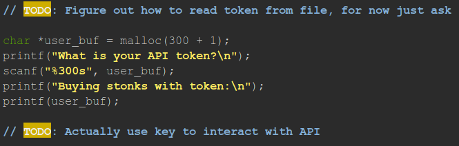
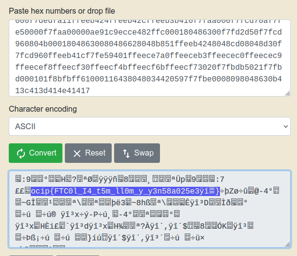

# Stonks Writeup

I started by getting the C program with `wget https://mercury.picoctf.net/static/7e71fc0d8cc3339bfad6bf408f7dc510/vuln.c`

After testing it with the netcat command I started analyzing the code and found a weird thing:



Usually when you `printf` something you make sure to do it like this `printf("%d", user_buf)` but in this case we didn't have the " ".

Because I'm still very noob in C programming I couldn't identify the vuln by myself so I started looking into "C printf vulnerabilities" on Google and found the "Format String attack", which looks exacly like what I need.

After playing with it for a bit I decided to spam `%x` when it asks for the token because that would print all the things in the buffer in hexadecimal values and I realized one of those things could be my flag.

I was right! After pasting all the hex values in the translator to ASCII I got this:



It looks like the standard format of picoCTF flags, but the letters are reversed every 4th character.

I could have done this manually but I thought it would be funnier with a Python script, but for some reason I was getting stuck so I had to copy one I found on YouTube:

```
flag = "ocip{FTC0l_I4_t5m_ll0m_y_y3n58a025e3ÿî"

for l in range(0, len(flag), 4):
    decoded = flag[l + 3] + flag[l + 2] + flag [l + 1] + flag[l]
    print(decoded, end = '') 
```
It gave me `picoCTF{I_l05t_4ll_my_m0n3y_0a853e52` so I just added a } in the end and that's how I got the flag!
