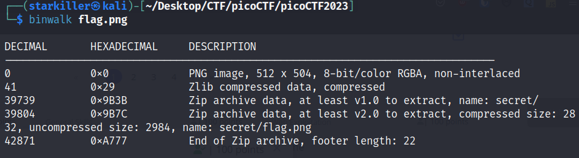

# hideme Writeup

The first flag I got on the 2023 competition, it was quite easy. 

I followed this [stenography checklist](https://stegonline.georgeom.net/checklist) but only got some lead on point 4, when I used this new tool for me called "Binwalk".

It surprised me because I never thought .png images could have files inside of them but it sure did:



Look at that, there's a folder named "secret" with the flag inside!

After extracting it I got 4 or 5 files and folders but honestly didn't look into them, I went straight for the "secret" and there it was, a picture of the flag:

```picoCTF{Hidding_An_imag3_within_@n_ima9e_c31884c/}```
