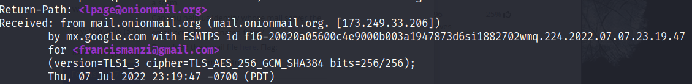
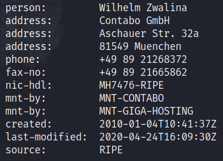

# who is it Writeup

The hint helps a lot in this problem, it tells us to use `whois` on the IP address which is a command that reveals details about a domain or address in this case.

After opening the email file with Nano I noticed this:

The IP I was looking for is 173.249.33.206 so after doing `whois 173.249.33.206` I get this in one of the columns:

Since we know the flag is picoCTF{FirstnameLastname} then the flag is `picoCTF{WilhemZwalina}`.