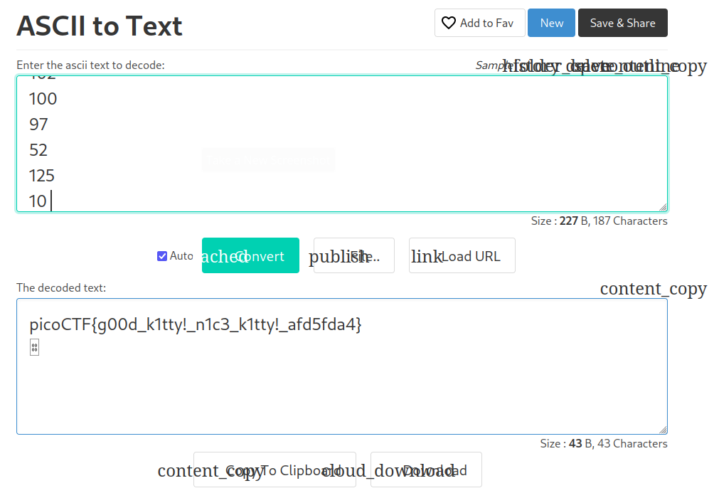

# Nice netcat... Writeup
Now things start to get more diverse, in this CTF we'll use a very popular networking tool called Netcat.

It's still pretty easy, just do what the problem says and paste `nc mercury.picoctf.net 21135` in your terminal/webshell.

You'll get a bunch of weird numbers... what are those? My Computer Systems class actually helped in this case because I recognised this as ASCII codes, a simple online ASCII to text translator should be able to handle this.

Pasting the numbers into the translator gives us this:

(My website appears broken I don't know why...)

And that's it! `picoCTF{g00d_k1tty!_n1c3_k1tty!_afd5fda4}` is our flag!

